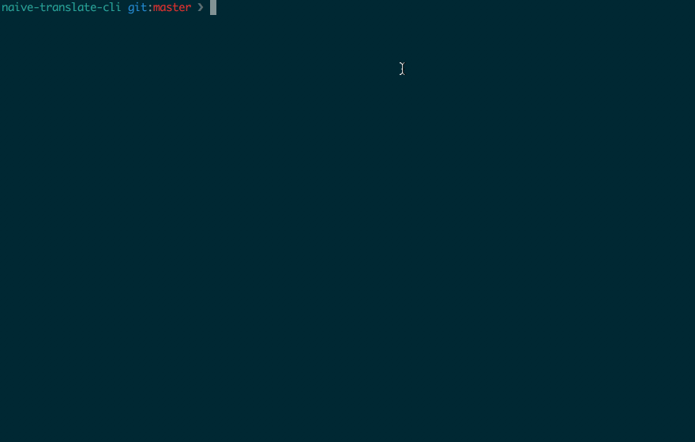

# Naive Translate CLI

Basic project created to test the new [async generator functions](https://github.com/tc39/proposal-async-iteration) coming in ES2018.

## Preview

## Set Up

`npm install`

## Run

`npm run cli`